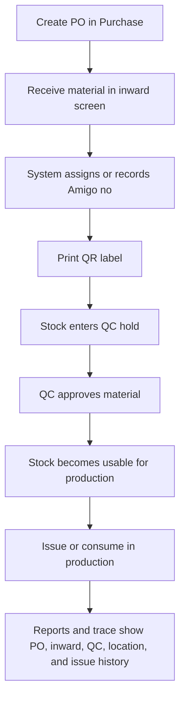

# Purchase, Inward, QC, QR, and Stock Report Update

Date: 2026-07-03

Live system: https://hariom-erp-production.up.railway.app

Railway deployment: `eb83c48d-8531-4dbd-a3ca-797b9464fc64`

Git commit: `f2c10ae` - `Add purchase inward QR lifecycle`

## Summary

The system now supports the client inward process from purchase order to stock receipt, QC hold, QR label printing, stock reporting, and later issue/consumption traceability.

The main rule is simple: every inward item gets one human-readable Amigo number. The same Amigo number is printed on the label and encoded in the QR code, so the item can be found again from inward, QC, report, and issue history.

## What Is Now Covered

| Area | What the user can do |
| --- | --- |
| Purchase order | Create a printable PO using the sample format: PO no/date, vendor, contact, address, item, width, GSM, plybond, bulk, COBB, rate, qty, terms, and special instruction. |
| Reel inward | Record mill, master paper, mill reel no, reel weight, Amigo no, slitted/regular, PO, bill, bill date, rate, location, and QC hold. |
| Paper quality lock | GSM, BF, plybond, bulk, and other paper facts come from master data and are shown as locked facts during reel inward. They are not edited on the inward page. |
| Adhesive inward | Record party/vendor, product, item, tank no, tank weight, Amigo no, bill, bill date, rate, weight out, wastage, location, and QC hold. |
| Parchment inward | Record vendor, color, thickness, pattern code, qty, rate, bill, bill date, location, and QC hold. More fields can be added when the client shares the final parchment template. |
| Bulk inward | Record item, vendor, qty, Amigo no, bill, bill date, rate, location, and QC hold using the same inward pattern. |
| QR label | The label shows Amigo number, QR, vendor, PO, bill, location, QC status, and material details. |
| Stock report | Inventory reports now include a client-style stock-as-on section with Amigo number, bill, PO, rate, location, QC status, current qty, and reel/batch specific fields. |
| QC block | New inward stock is put into QC hold, so production cannot use it until QC releases it. |

## Main Flow



## How to Use: Purchase Order

1. Open `Purchase`.
2. Enter the PO number and PO date.
3. Select the vendor/supplier.
4. Fill vendor contact, address, GST, payment terms, freight/tax notes, delivery terms, test report requirement, and special instruction.
5. Add the line item details:
   - Description, for example `KRAFT BOARD`.
   - Width in mm.
   - GSM.
   - Plybond.
   - Bulk.
   - COBB.
   - Quantity.
   - Rate.
6. Use the printable preview to check how the PO will look.
7. Save the PO, then approve it when ready.
8. When material arrives, receive it through GRN or direct inward depending on the store workflow.

## How to Use: Reel Inward

1. Open `Inventory > Reels > Inward`.
2. Select the paper master.
3. The system shows locked quality facts from the master. These values are only edited from master data, not during inward.
4. Enter the client inward details:
   - Amigo no, for example `AIT 00001`.
   - Mill.
   - Mill reel no.
   - Reel weight.
   - Slitted/regular.
   - PO number.
   - Bill number and bill date.
   - Rate.
   - Location.
5. Save inward.
6. Print the label shown after save.
7. Paste the label on the physical reel.
8. Keep the reel in QC hold until QC approves it.

### Reel Example

| Field | Example |
| --- | --- |
| Mill | VATSALYA |
| Plybond | 18BF, locked from master |
| Variety | 230, locked from master |
| GSM | 230, locked from master |
| Mill reel no | 175016 |
| Reel weight | 715 kg |
| Amigo no | AIT 00001 |
| Slitted/regular | REGULAR |
| PO | 44 |
| Bill | VPI/1/2026-27 |
| Rate | 30 |
| Location | Selected store location |

## How to Use: Adhesive, Parchment, and Bulk Inward

1. Open `Inventory > Raw Material Inward`.
2. Choose material type:
   - Adhesive.
   - Parchment.
   - Bulk.
3. Select item and vendor.
4. Enter Amigo no. This becomes the QR label identity.
5. Enter quantity, rate, bill, bill date, and location.
6. Fill material-specific fields.
7. Save inward.
8. Print and attach the label.
9. QC must approve before production can issue the material.

### Adhesive Example

| Field | Example |
| --- | --- |
| Party name | Poonam Corporation |
| Product | ADHESIVE |
| Item | Wellcol EM30100 |
| Tank no | 1 |
| Tank weight | 1000 |
| Amigo no | AIT 00001 |
| Bill | 2026-2027/0004 |
| Bill date | 02-04-2026 |
| Rate | 24 |
| Location | Selected store location |

### Parchment Example

| Field | Example |
| --- | --- |
| Vendor | Selected parchment vendor |
| Color | Client color |
| Thickness | Client thickness |
| Pattern code | Client pattern code |
| Qty | Enter received qty |
| Amigo no | Enter label no |
| Location | Selected store location |

## QC Rule

All new inward material is protected by QC hold.

This means:

- Store can record and label the material immediately.
- The stock is visible in stock reports.
- Production cannot use it as unrestricted stock until QC approval.
- When QC approves it, stock becomes available for floor issue.
- If QC holds it, it remains blocked for production.

## QR and Label Rule

The Amigo number is the main physical tracking identity.

For example:

```text
Amigo no: AIT 00001
Label text: AIT 00001
QR value: includes AIT 00001 and stock identity
```

When a user scans or searches that number, the system can trace:

- Material type.
- Vendor/mill.
- PO and bill details.
- Location.
- QC status.
- Current balance.
- Issue/consumption history.

## Stock-As-On Report

Open `Reports > Inventory`, then use `Client stock-as-on`.

The report shows a client-style table for:

- Reels.
- Adhesive.
- Parchment.
- Bulk items.

The report includes:

- Date.
- Party/mill.
- Product/item.
- Amigo no.
- Reel/tank/qty details.
- PO.
- Bill and bill date.
- Rate.
- Location.
- QC status.
- Current quantity.
- Issue status.

## Traceability Example

1. Store receives reel `AIT 00001`.
2. The inward screen records mill `VATSALYA`, mill reel no `175016`, weight `715 kg`, PO `44`, bill `VPI/1/2026-27`, rate `30`, and location.
3. System prints QR label `AIT 00001`.
4. Reel stays in QC hold.
5. QC approves the reel.
6. Production issues or consumes the reel later.
7. Inventory report can still show where `AIT 00001` came from and what happened to it.

## Verification Evidence

Local checks completed:

| Check | Result |
| --- | --- |
| Backend unit tests | 28 tests passed |
| TypeScript compile | Passed |
| Frontend lint | Passed, no warnings or errors |
| Frontend unit/static tests | Passed |
| Production build | Passed, 101 pages generated |
| Local browser smoke | Passed login, purchase, reel inward, raw inward, inventory report, and stock-as-on API |

Live checks completed on Railway:

| Check | Result |
| --- | --- |
| Railway deployment | `SUCCESS` |
| Live login | Passed |
| Live purchase page | Passed |
| Live reel inward page | Passed |
| Live raw inward page | Passed |
| Live inventory report page | Passed |
| Live stock-as-on API | Passed with HTTP 200 |

## Notes for Client Discussion

- The client can start using this for reel inward and adhesive inward now.
- Parchment and bulk inward already have the base capture flow. If the client sends more exact fields tomorrow, those can be added into the same structure without changing the overall stock lifecycle.
- Paper quality values must be maintained in the paper master. Operators only select the paper during inward and cannot override those locked quality facts there.
- Amigo number should be unique. The system now rejects duplicate Amigo/batch numbers for direct inward and reel inward also enforces unique reel/Amigo numbers.
